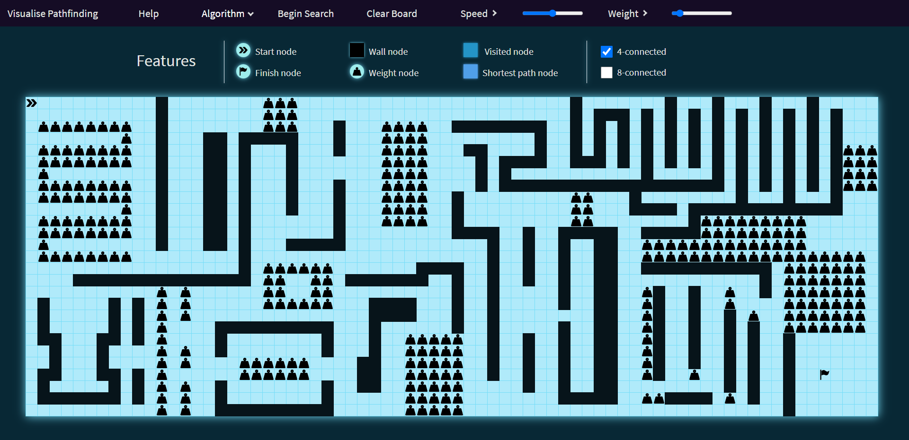
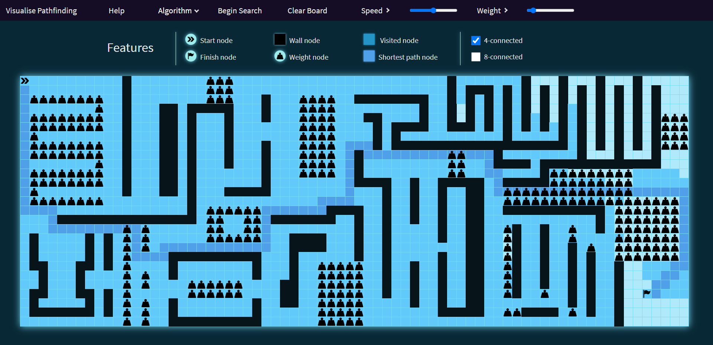

# Pathfinding Algorithm Visualiser

React app to visualise common pathfinding algorithms in a grid-like environment. You can add walls, weighted obstacles, change start and end nodes to observe behaviours in different situations.

# Run
npm start

### Notes
Can add "node_modules" to .gitignore, had some dependency issues previously so left it in repository. 
There are still visual bugs and other slightly annoying glitches, have not updated since 2021. 